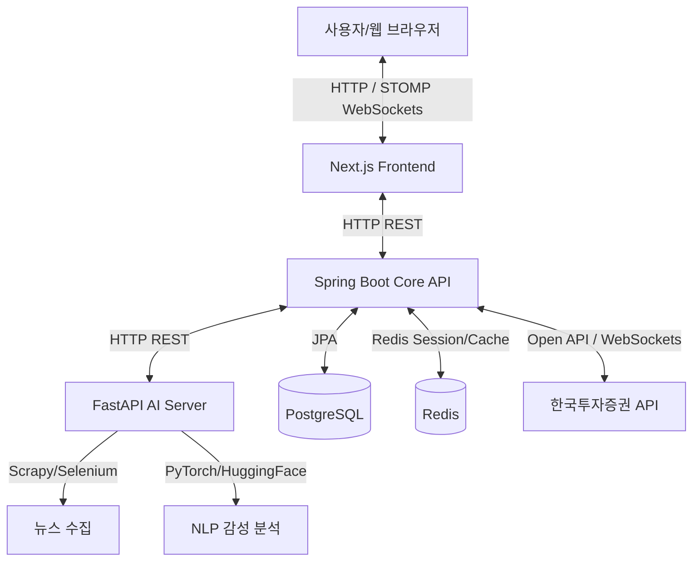

# 🤖 StockAI — AI 뉴스 기반 주식 추천 및 시뮬레이션 서비스

> **실시간 뉴스 감성 분석**과 **사용자 투자 성향**을 결합한 맞춤형 주식 추천 및 백테스팅 투자 서비스

**StockAI**는 인공지능(AI) 기술을 활용하여 실시간 뉴스를 수집 및 감성 분석(긍정/부정 스코어링)하고, 사용자의 투자 성향에 맞춘 종목 추천, 실시간 시세 연동(WebSocket), AI 스마트 예약 매수 바스켓 및 백테스팅 시뮬레이터를 제공하는 통합 금융 투자 플랫폼입니다.

---

## 🚀 주요 기능 (Key Features)

1. **AI 뉴스 수집 및 감성 분석**
   - BeautifulSoup4 및 Selenium 기반 실시간 뉴스 기사 크롤링 (FastAPI)
   - PyTorch & HuggingFace NLP 모델을 이용한 뉴스 감성 분석(긍정/부정 점수 추출) 및 트렌드 시각화
2. **실시간 시세 & 호가 연동 (STOMP WebSocket)**
   - 한국투자증권(KIS) Open API 실시간 시세 WebSocket 데이터 연동
   - 장 마감 후 변동성 제한 및 실시간 가격 업데이트 차트 (Lightweight Charts)
3. **투자 성향 맞춤형 주식 추천**
   - 설문조사를 통한 투자 성향 분석 (안정형, 공격투자형 등) 및 맞춤형 종목 매칭
   - 국내 주식 및 해외 주식 실시간 카탈로그 제공
4. **AI 스마트 예약 매수 & 백테스팅 시뮬레이터**
   - 사용자가 구성한 전략에 따라 모의 자동 예약을 거는 스마트 매수 바스켓(장바구니)
   - 과거 데이터를 기반으로 투자 전략의 수익률을 시뮬레이션하는 백테스팅 시스템
5. **실시간 체결 및 거래 알림 시스템**
   - 체결 발생 시 토스트 알림을 통한 즉각적인 피드백 제공 및 알림 이력 관리
6. **관리자 모니터링 대시보드**
   - KIS API 인증 토큰 관리, API 서버 상태 모니터링 기능 제공

---

## 📐 서비스 아키텍처 (Architecture)



---

## 🛠️ 기술 스택 (Technology Stack)

### Frontend
- **Framework**: Next.js 16 (App Router), React 19, TypeScript
- **Styling**: Tailwind CSS v4, Shadcn/ui
- **Charting**: Lightweight Charts (TradingView)
- **Real-time Communication**: STOMP WebSocket (`@stomp/stompjs`, `sockjs-client`)

### Backend (Core API)
- **Framework**: Spring Boot 3.3.5, Java 17
- **Database**: PostgreSQL, Spring Data JPA, Flyway (DB Migration)
- **Caching**: Redis (Spring Data Redis), Caffeine Local Cache
- **Security**: Spring Security, JWT (JJWT 0.12.6), BCrypt
- **Resiliency & Traffic Control**: Resilience4j (Circuit Breaker), Bucket4j (Rate Limiter)
- **Integration**: WebClient (Spring WebFlux), KIS Open API (국내/해외 시세 및 주문)

### AI Backend
- **Framework**: FastAPI (Uvicorn), Python 3.10+
- **AI/NLP**: PyTorch, HuggingFace Transformers
- **Crawling**: BeautifulSoup4, Selenium
- **Database**: SQLAlchemy, asyncpg

---

## 📂 프로젝트 구조 (Project Structure)

```text
StockAI/
├── AGENT.md                  # Git 브랜치 전략 및 커밋 규칙 (GitHub-Flow 가이드)
├── README.md                 # 본 파일 (전체 프로젝트 안내 및 통합 실행 가이드)
├── docker-compose.yml        # Docker Compose 설정 (전체 서비스 컨테이너 실행)
├── run-servers.bat           # 로컬 서버 멀티 탭/윈도우 통합 실행 스크립트
├── run-opencode.bat          # 개발 터미널 다중 탭 실행 스크립트
│
├── FE/
│   ├── stock-frontend/       # Next.js 프론트엔드
│   │   ├── src/
│   │   │   ├── app/          # Next.js App Router 페이지 및 레이아웃
│   │   │   ├── components/   # 공통 및 페이지 UI 컴포넌트
│   │   │   ├── hooks/        # React Custom Hooks
│   │   │   └── services/     # API 통신 및 WebSocket 서비스
│   │   ├── AGENT.md          # FE 프로젝트 전용 가이드
│   │   └── SKILL.md          # FE 기술 패턴 & 구현 가이드
│   ├── API_ENDPOINTS.md      # 백엔드 API 명세서
│   └── DESIGN.md             # UI/UX 디자인 가이드 및 컴포넌트 스펙
│
└── BE/
    ├── stock-core-api/       # Spring Boot Core API
    │   ├── src/main/java/com/stock/
    │   │   ├── domain/           # JPA 엔티티 및 리포지토리
    │   │   ├── service/          # 핵심 비즈니스 로직
    │   │   ├── controller/       # REST API 엔드포인트 및 DTO
    │   │   ├── infrastructure/   # 외부 연동(KIS, AI), Security, WebSocket Config
    │   │   └── exception/        # 전역 예외 처리
    │   ├── build.gradle
    │   ├── AGENT.md          # Spring Boot 프로젝트 전용 가이드
    │   └── SKILL.md          # Spring Boot 기술 패턴 & 구현 가이드
    │
    └── stock-ai-server/        # FastAPI AI 서버
        ├── app/
        │   ├── api/              # API 라우터 및 엔드포인트
        │   ├── models/           # Pydantic DTO 스키마
        │   ├── services/         # AI 분석, 뉴스 크롤링 서비스
        │   └── infrastructure/   # Redis 및 데이터베이스 세션
        ├── requirements.txt
        ├── AGENT.md          # FastAPI 프로젝트 전용 가이드
        └── SKILL.md          # FastAPI 기술 패턴 & 구현 가이드
```

---

## 🚦 실행 및 배포 방법 (How to Run)

### 방법 1. 통합 실행 스크립트 사용 (Windows - 권장)
Windows Terminal이 설치된 경우, 프로젝트 루트에서 아래의 배치 파일을 실행하여 백엔드, 프론트엔드, AI 서버를 단일 터미널 창의 여러 탭으로 동시에 실행할 수 있습니다.
```bash
./run-servers.bat
```

### 방법 2. Docker Compose를 통한 컨테이너 실행
PostgreSQL, Redis를 포함한 전체 어플리케이션 스택을 컨테이너 환경에서 통합 빌드 및 실행할 수 있습니다.
```bash
docker-compose up -d --build
```

### 방법 3. 개별 수동 실행
각 서버의 디렉토리로 이동하여 순서대로 실행합니다. (.env 환경변수 설정 필수)

1. **AI 서버** 실행:
   ```bash
   cd BE/stock-ai-server
   uvicorn app.main:app --reload
   ```
2. **Core API** 실행:
   ```bash
   cd BE/stock-core-api
   ./gradlew bootRun
   ```
3. **Frontend** 실행:
   ```bash
   cd FE/stock-frontend
   npm run dev
   ```

### 🔌 기본 포트 정보
- **Frontend (Next.js)**: `http://localhost:3000`
- **Core API (Spring Boot)**: `http://localhost:8080`
- **AI Server (FastAPI)**: `http://localhost:8000`
- **Database (PostgreSQL)**: `5432`
- **Cache (Redis)**: `6379`

---

## 🌿 브랜치 전략 (GitHub-Flow)

본 프로젝트는 빠르고 안정적인 배포를 위해 **GitHub-Flow** 브랜치 전략을 준수합니다.
- `main` 브랜치는 언제나 빌드 및 배포가 가능한 안정적인 상태를 유지합니다.
- 새로운 기능 개발이나 수정 작업은 `feature/기능이름` 또는 `bugfix/이슈번호` 형태의 브랜치에서 진행됩니다.
- 작업 완료 후 Pull Request(PR)를 작성하여 코드 리뷰와 자동화 테스트(CI) 통과 후 `main`에 머지합니다.
- 상세한 커밋 및 브랜치 규칙은 [AGENT.md](AGENT.md)를 참고하세요.

---

> 본 가이드라인이나 추가적인 상세 기술 사양에 대해 의문이 있을 경우 각 모듈 폴더 내 `AGENT.md` 및 `SKILL.md` 문서를 참고해 주세요.