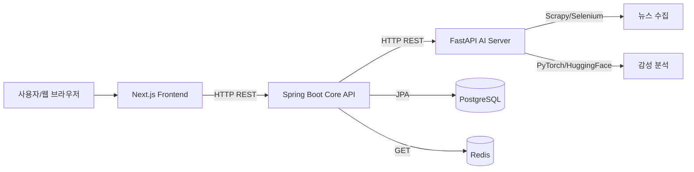

# 🤖 StockAI — 전체 프로젝트 개요

> AI 뉴스 기반 주식 추천 서비스의 통합 문서

**StockAI**는 인공지능 기술을 활용하여 실시간 뉴스를 분석하고, 사용자의 투자 성향에 맞춰 맞춤형 주식 종목을 추천하는 서비스입니다.

---

## 1. 서비스 개요

### 목표
실시간 뉴스 크롤링 및 감성 분석을 통해 얻은 인사이트를 바탕으로, 사용자가 자신의 투자 성향(안정형/공격형 등)에 맞는 최적의 종목을 추천받을 수 있도록 지원합니다.

### 아키텍처 개요



### 기술 스택

#### Frontend
- Next.js (App Router), TypeScript, Tailwind CSS, Shadcn/ui, Lightweight Charts

#### Backend (Core API)
- Spring Boot, Spring Data JPA, WebClient, Spring Security, JWT, Redis, PostgreSQL

#### AI Backend
- FastAPI, PyTorch, HuggingFace, BeautifulSoup4, Selenium

---

## 2. 프로젝트 구조

```text
StockAI/
├── AGENT.md                  # 전체 프로젝트 문서
├── GitHub-Flow.md            # Git 브랜치 전략, 커밋 규칙
│
├── FE/stock-frontend/         # Next.js 프론트엔드
│   ├── src/
│   │   ├── app/              # 페이지, 라우트
│   │   ├── components/       # UI 컴포넌트
│   │   ├── hooks/            # React 훅
│   │   └── services/         # API 클라이언트
│   └── package.json
│
└── BE/
    ├── stock-core-api/       # Spring Boot Core API
    │   ├── src/main/java/com/stock/
    │   │   ├── domain/           # JPA Entity
    │   │   ├── service/          # 비즈니스 로직
    │   │   ├── controller/       # REST API
    │   │   ├── infrastructure/   # DB, Redis, AI Client 등
    │   │   └── exception/        # 예외 처리
    │   ├── build.gradle
    │   ├── settings.gradle
    │   └── AGENT.md              # Spring Boot 프로젝트 문서
    │   └── SKILL.md              # 기술 패턴, 구현 가이드
    │
    ├── stock-ai-server/        # FastAPI AI 서버
    │   ├── app/
    │   │   ├── api/              # 엔드포인트
    │   │   ├── models/           # Pydantic DTO
    │   │   ├── services/         # AI 로직
    │   │   └── infrastructure/   # Redis, DB 연결
    │   ├── requirements.txt
    │   └── AGENT.md              # FastAPI 프로젝트 문서
    │   └── SKILL.md              # 기술 패턴, 구현 가이드
    │
    └── requirements.txt        # (최상위 프로젝트 공용 — 추후 정리)
```

---

## 3. 기술 스택 요약

| 카테고리 | 기술 | 역할 |
|----------|------|------|
| **프론트엔드** | Next.js | 웹 UI, SSR, SEO |
| | TypeScript | 정적 타입 지원 |
| | Tailwind CSS | 스타일링 |
| **백엔드** | Spring Boot | API 서버, 트랜잭션, 보안 |
| | JPA + PostgreSQL | ORM, 데이터베이스 |
| | Spring WebClient | 비동기 HTTP 클라이언트 |
| | Spring Security | JWT 기반 인증/인가 |
| | Redis | 캐싱, 실시간 데이터 |
| | **KIS API** | 한국투자증권 Open API 연동 |
| **AI 서버** | FastAPI | 비동기 AI API 서버 |
| | PyTorch | 딥러닝 모델 서빙 |
| | HuggingFace | NLP 모델 사용 |
| | BeautifulSoup4/Selenium | 뉴스 크롤링 |

---

## 4. 워크플로우

1. **뉴스 수집** (FastAPI) → 웹사이트 크롤링 및 실시간 업데이트
2. **감성 분석** (FastAPI) → 뉴스 제목/본문의 긍정/부정 점수 추출
3. **사용자 입력** (Next.js) → 사용자의 투자 성향 설문조사
4. **추천 요청** (Next.js → Spring Boot → FastAPI) → 최적의 종목 추천
5. **데이터 표시** (Next.js) → 사용자 맞춤형 대시보드, 뉴스, 차트

---

## 5. 기술 패턴 & 구현 가이드

- **Stock-Core-API:** [SKILL.md](BE/stock-core-api/SKILL.md)
- **Stock-AI-Server:** [SKILL.md](BE/stock-ai-server/SKILL.md)

각 서버의 기술 스택별 구현 방법, 성능 최적화, 모범 사례가 담겨 있습니다.

---

## 6. 브랜치 전략

- GitHub-Flow 사용
- `main` 브랜치는 항상 배포 가능한 상태
- 기능 개발 시 `feature/task` 브랜치 사용
- Pull Request 통한 코드 리뷰 후 머지
- **상세:** [GitHub-Flow.md](GitHub-Flow.md)

---

## 7. 실행 방법

### 순서
1. **AI 서버** 실행
   ```bash
   cd BE/stock-ai-server
   uvicorn app.main:app --reload
   ```

2. **Core API** 실행
   ```bash
   cd BE/stock-core-api
   ./gradlew bootRun
   ```

3. **Frontend** 실행
   ```bash
   cd FE/stock-frontend
   npm run dev
   ```

### 기본 포트
- Frontend: `http://localhost:3000`
- Core API: `http://localhost:8080`
- AI Server: `http://localhost:8000`

---

## 8. 디렉터리별 역할 요약

| 디렉터리 | 역할 |
|---------|------|
| `FE/` | Next.js 프론트엔드 (React) |
| `BE/stock-core-api/` | Spring Boot 메인 서버 |
| `BE/stock-ai-server/` | FastAPI AI 분석 서버 |
| `GitHub-Flow.md` | Git 브랜치 전략, 커밋 규칙 |
| `AGENT.md` | **본 파일 (전체 요약)** |
| `SKILL.md` | 기술 스택, 구현 가이드 (각 프로젝트별 별도 파일) |

---

> 궁금한 점은 언제든지 문서나 관련 `AGENT.md`를 참고하세요.